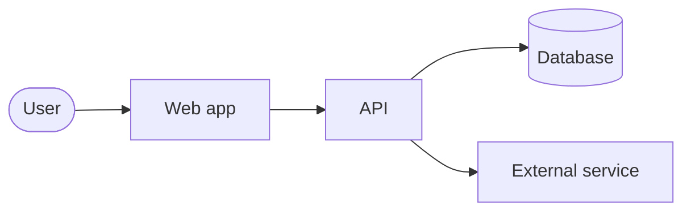

# README recipe

What a repository README must contain, in what order, how it should look, and how to keep it true. Written for repositories that people work in every day: internal services, platforms, infrastructure and tooling, as well as open-source projects. Where a team publishes its own README standard, its section names win; map these sections onto them rather than running two structures.

## Principles

1. **One reader.** Write for the engineer who cloned the repository ten minutes ago and needs to run it. Product managers, customers and auditors get their own documents, linked from here.
2. **Funnel.** The most important and most stable information first: what this is, who it serves, who owns it. Detail increases down the page. Anything that takes more than a screen moves to `docs/` and leaves a one-line summary and a link.
3. **Link, never duplicate.** If an authoritative source exists (a pipeline definition, a Terraform module, a team handbook page, a docs site), link to it. Two copies of a fact will disagree within a quarter.
4. **Exact names.** Commands, paths, variables, services and environments are copied from the file that defines them, never paraphrased. This is what lets a reviewer or a checker grep the README against the tree and prove it still true.
5. **Trimmed, not grown.** Every change to the code that makes a sentence untrue changes that sentence in the same pull request. Delete before adding. A short, true README beats a long, mostly true one.

## Sections, in order

Headings are suggestions; the order and the content are not.

### 1. Title and one line

The repository name as an `#` heading, then one sentence: what it is and who it is for. Under 120 characters. No heading for the sentence. This is the line search results and the repository listing show.

### 2. What and why

One to three short paragraphs. What the system does, the problem it solves, who uses it, and what is deliberately out of scope. Studies of thousands of READMEs find "why" is the section most often missing; do not skip it. If the repository is one part of a larger solution, say which part and link to the solution's front door.

### 3. Status and owners

Three or four lines, or a small table:

- **Status**: active, maintained, frozen, deprecated (with the replacement linked).
- **Owners**: the team, and how to reach them (channel, alias). Not individual names, which leave.
- **Help**: where to ask, where incidents go, where the runbook is.

For an internal service this is the section the on-call engineer reads at three in the morning. It is absent from almost every open-source template, which is why internal READMEs so often lack it.

### 4. Built with

A bullet list of the languages, frameworks, runtimes, data stores, cloud services and first-party libraries that a reader must know to work here. Each with its version if the version matters and a link to its documentation. Ten lines or fewer; the manifests hold the rest.

### 5. Architecture

One diagram and a paragraph. The diagram is a context or container view (C4 terms): this system, the systems it talks to, the stores it owns, and the direction of calls. Written as Mermaid in the file so the diagram diffs with the code. A paragraph names the main components and the one or two design decisions a newcomer would otherwise question. Detail (sequence diagrams for non-trivial flows, component views, decision records) goes to `docs/architecture/` and is linked. If the canonical model lives in an external tool, link to it and keep the Mermaid view as the summary; never paste an exported image.

### 6. Getting started

The shortest path from clone to running locally, then to running the tests. Assume nothing about the reader's machine: list the prerequisites with versions and where to get them, then the commands, in a fenced block, in the order they are run. Target: one command after prerequisites. Include how to get any credentials or configuration the system needs (where they come from, never their values). End with how to attach a debugger and where logs appear.

If this takes more than a screen, the README keeps the prerequisites and the first command and links to `docs/development.md` for the rest. The commands shown are the same commands the pipeline runs, so CI proves them daily.

### 7. Environments and deployment

A table of environments: name, purpose, address, how it is deployed to (pipeline name, trigger, approval), who can deploy. Then the deployment procedure, or a link to it: how a change reaches each environment, how to roll back, what to check afterwards. Link to the pipeline definition and the infrastructure code rather than describing them; if infrastructure inputs must be documented, generate that documentation (for example with `terraform-docs`) rather than typing it.

### 8. Repository layout

An annotated tree of the top level only, with one short phrase per entry, listing only the directories a reader would look for. Deeper structure is the code's job.

### 9. Gotchas

Things that have bitten someone: surprising behaviour, known limitations, risky operations, work-arounds and the issue they track. One line each. Prune when fixed. This section is a list, not an essay.

### 10. Further reading

Links, grouped: user-facing documentation, design records, runbooks, related repositories, the team handbook. One line each. User guides live here as links; they have a different reader and do not belong in the body.

### 11. Contributing and licence

How to branch, test and get a change reviewed, or a link to the team's standard. The licence, for anything that leaves the organisation. Open-source repositories put `CONTRIBUTING.md`, `LICENSE`, a code of conduct and a security policy alongside, and link to them here.

## Presentation

- **Badges** only for live signals: build status, test coverage, deployed version. Each must link to the thing it reports. No version, licence, downloads or "made with" badges on an internal repository. Three at most, on one line under the title.
- **Imagery**: one hero image or none. A screenshot only when the user interface is what the repository produces. Diagrams are Mermaid text, never images.
- **Tone**: plain words, short sentences, UK English, no emoji, no marketing, no exclamation marks. The reader is a colleague in a hurry.
- **Tables** for anything with three or more attributes per row (environments, commands, stack). Bullets for lists. Prose for explanation.
- **Length**: readable in five minutes. Each section under one screen. A table of contents only when the file passes about a hundred lines, and then generated, not typed.
- **Links** relative within the repository so they survive clones and forks.

## Several repositories, one solution

The solution's front door is one README (in the main repository or a dedicated one) that carries the What and why, the Architecture, the Environments and the list of repositories with one line each. Each repository's README then covers only itself, starts by naming the solution it belongs to and links back. A monorepo does the same with a README per deployable package.

## Keeping it true

Every sentence in a README is one of four kinds. Know which before writing it.

| Kind | Example | How it stays true |
|------|---------|-------------------|
| Stable | what the system is for | rarely changes; reviewed on the PR |
| Anchored | a command, a path, a variable | exact name; a checker greps the tree for it |
| Generated | infrastructure inputs, CLI help | produced by a tool in CI or a pre-commit hook |
| Linked | the branching strategy | one authoritative copy elsewhere |

Anything that is none of these is a sentence that will rot. Rewrite it into one of the kinds or delete it.

Practices, in order of value for effort:

1. **Docs change with the code.** A pull request to `main` includes the documentation check from `/flow:review`: the `flow:docs-checker` agent follows every document the README links and reports broken paths, statements the diff made untrue, and additions no document mentions. The PR body records the outcome under a `Docs:` line.
2. **Code owners for documentation.** A `CODEOWNERS` entry for `README.md` and `docs/**` requiring a review puts a second reader on every documentation change without a checklist.
3. **Link checking in CI.** A Markdown link checker such as `lychee` catches the commonest decay for almost no setup. Keep an ignore list for flaky external hosts.
4. **Generate what changes often.** Module inputs, command help, endpoint lists. A generated section cannot drift.
5. **Diagrams as text**, in the same pull request as the change they describe, so the diagram's diff is reviewed alongside the code's.
6. **Prove the commands.** The commands in Getting started are the pipeline's commands. Where a project has a test runner that can execute documentation examples, use it.
7. **Read it through once a quarter.** Automated checks find what is false; only a reader finds what is missing or no longer worth saying.

Do not add a "last reviewed" date. It attests that someone looked, not that the text is true, and it becomes one more thing that goes stale.

## Checklist

Used by `/flow:readme check` to score a README. Each line is pass or fail.

- [ ] Title and a one-line description under 120 characters
- [ ] Says what it is for, who uses it, and what is out of scope
- [ ] Status stated; owners and where to get help named as a team or channel
- [ ] Stack listed with versions where they matter
- [ ] One architecture diagram as Mermaid, or a link to the model plus a Mermaid summary
- [ ] Prerequisites with versions; clone to running in the fewest possible commands; tests; debugging; where configuration comes from
- [ ] Environments table with addresses and deployment route; deployment and rollback procedure or link
- [ ] Top-level layout annotated
- [ ] Gotchas present or an explicit "none known"
- [ ] User guides, runbooks and related repositories linked, not inlined
- [ ] Contributing route and licence where applicable
- [ ] Badges are live signals only, three or fewer; no emoji; no images of diagrams
- [ ] Every command, path, variable and name matches the tree exactly
- [ ] No section over one screen; anything longer is summarised and linked
- [ ] No sentence that is neither stable, anchored, generated nor linked

## Skeleton

````markdown
# <name>

<One sentence: what it is and who it is for.>

[build badge] [coverage badge]

## What it does

<Problem, users, scope. Link to the solution front door if this is one part.>

## Status and owners

| | |
|---|---|
| Status | active |
| Owners | <team>, <channel> |
| Help | <channel>; incidents: <link>; runbook: <link> |

## Built with

- <language and version>
- <framework>
- <store, queue, cloud service>

## Architecture



<One paragraph: components, the decisions a newcomer would question. Link docs/architecture/.>

## Getting started

Prerequisites: <tool version, where to get it>.

```bash
<clone>
<one command to run>
<one command to test>
```

<Where configuration and credentials come from. How to debug. Where logs go. Link docs/development.md if longer.>

## Environments and deployment

| Environment | Purpose | Address | Deployed by | Who |
|---|---|---|---|---|
| dev | | | <pipeline>, on merge to main | |
| prod | | | <pipeline>, manual approval | |

<How a change reaches each environment; rollback; post-deploy checks. Link pipeline and infrastructure code.>

## Layout

```
src/      <phrase>
tests/    <phrase>
infra/    <phrase>
docs/     <phrase>
```

## Gotchas

- <one line, with the issue link>

## Further reading

- User guide: <link>
- Design records: <link>
- Related repositories: <link>

## Contributing

<Branching, testing, review; or a link to the standard.>
````

## Sources

The recipe draws on: GitHub's guidance on READMEs and community health files; Google's developer documentation style guide (READMEs and best practices, including "link, do not duplicate" and named ownership); the Standard Readme specification (section order, 120-character description); the Art of README (the funnel, judicious badges); makeareadme.com; Write the Docs (docs as code, restraint); Diátaxis (the four documentation types the README should point to, and the observation that documentation decays without governance); Tom Preston-Werner's Readme Driven Development; Prana et al. 2018 (the "why" and status gaps); Trockman et al. 2018 (which badges signal real practice); the Microsoft engineering fundamentals playbook; and the README pages of widely admired open-source projects, whose common shape is a confident one-line pitch, proof it works, and a firm hand-off to fuller documentation.
